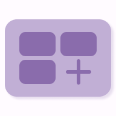
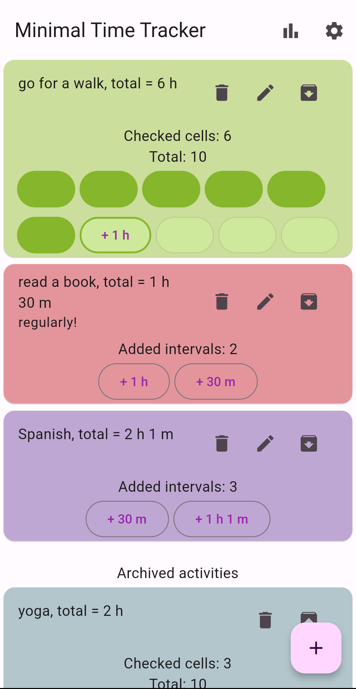
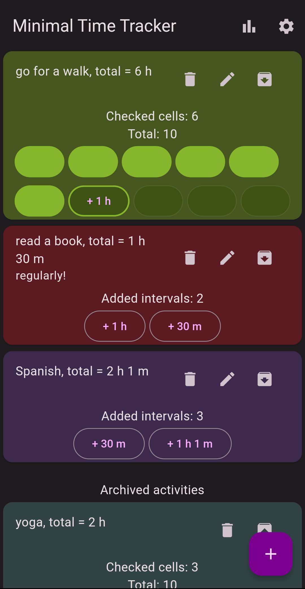
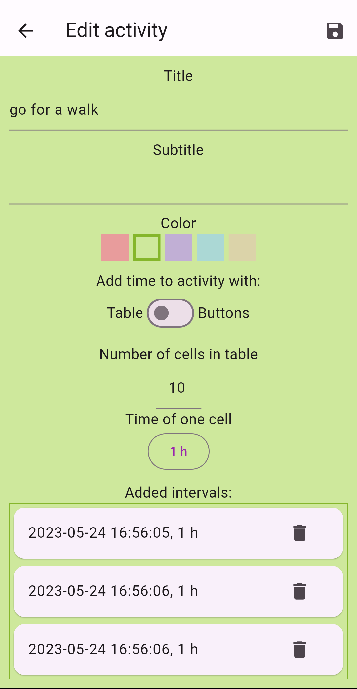
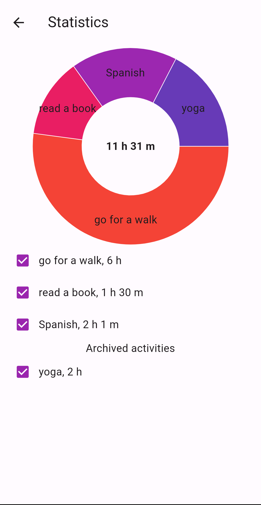

# Minimal time tracker

  

This project is a simple tracker that allows you to check time spent on your activities.
The app is build using [Flutter](https://flutter.dev/).

## Features
- add activities, add time intervals to them
- redact details of existing activities
- add activities to archive, which can be hided
- see overall statistics for chosen activities as pie chart
- change theme, light/dark mode, language (ru/en), font size

## Screenshots
 
 

## Packages
Following pub packages are used in this project:
|Package|Usage|
|-|-|
|[flutter_bloc](https://pub.dev/packages/flutter_bloc)|State management|
|[localization](https://pub.dev/packages/localization), [flutter_localization](https://pub.dev/packages/flutter_localization), (intl)(https://pub.dev/packages/intl)|In-app localization|
|[hive](https://pub.dev/packages/hive), [hive_flutter](https://pub.dev/packages/hive_flutter)|Data storage|
|[shared_preferences](https://pub.dev/packages/shared_preferences)|Data storage for settings (such as theme, font size, etc)|
|[fl_chart](https://pub.dev/packages/fl_chart)|Data visualization|
|[url_launcher](https://pub.dev/packages/url_launcher)|Opening urls|
|[package_info_plus](https://pub.dev/packages/package_info_plus)|Getting info about app package|
|[bloc_test](https://pub.dev/packages/bloc_test), [hive_test](https://pub.dev/packages/hive_test), [mocktail](https://pub.dev/packages/mocktail)|Testing|

## Next
Features that I plan to add in future:
- adding time to activities with timer
- activities without time (for incrementing with units like books, podcasts, etc)
- changing time interval for statistics

## License
[MIT License](https://en.wikipedia.org/wiki/MIT_License)