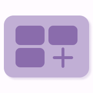

# Minimal time tracker - [EN](README.md) | RU

  

Этот проект является простым трекером для ослеживания времени время, затраченного на ваши активности.
Приложение создано с помощью [Flutter](https://flutter.dev).

## Функциональность
- добавление активностей, дабавление временных интервалов к ним
- редактирование данных существующих активностей
- добавление активностей в архив, который можно скрыть
- статистика для всех выбранных активностей в виде pie chart
- изменение темы, светлого/тёмного режима, языка (ru/en), размера шрифта

## Скриншоты
   
   

## Пакеты
В этом проекте использованы следующие пакеты:
|Пакет|Использование|
|-|-|
|[flutter_bloc](https://pub.dev/packages/flutter_bloc)|Управление состоянием|
|[localization](https://pub.dev/packages/localization), [flutter_localization](https://pub.dev/packages/flutter_localization), [intl](https://pub.dev/packages/intl)|Локализация|
|[hive](https://pub.dev/packages/hive), [hive_flutter](https://pub.dev/packages/hive_flutter)|Хранение данных|
|[shared_preferences](https://pub.dev/packages/shared_preferences)|Хранение данных для настроек (таких как тема, размер шрифта, и т.д.)|
|[fl_chart](https://pub.dev/packages/fl_chart)|Визуализация данных|
|[url_launcher](https://pub.dev/packages/url_launcher)|Открытие ссылок|
|[package_info_plus](https://pub.dev/packages/package_info_plus)|Получение данных о приложении|
|[bloc_test](https://pub.dev/packages/bloc_test), [hive_test](https://pub.dev/packages/hive_test), [mocktail](https://pub.dev/packages/mocktail)|Тестирование|

## Дальше
Функциональности, которые я планирую добавить в будущем:
- добавление времени в активность с помощью таймера
- активности без времени (в них будут прибавляться книги подкасты, и т.д.)
- изменение интервала для диаграммы статистики

## Лицензия
[MIT License](https://en.wikipedia.org/wiki/MIT_License)